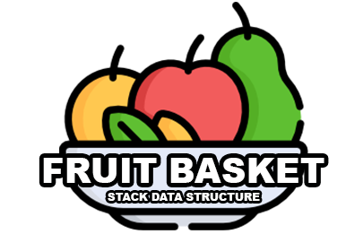
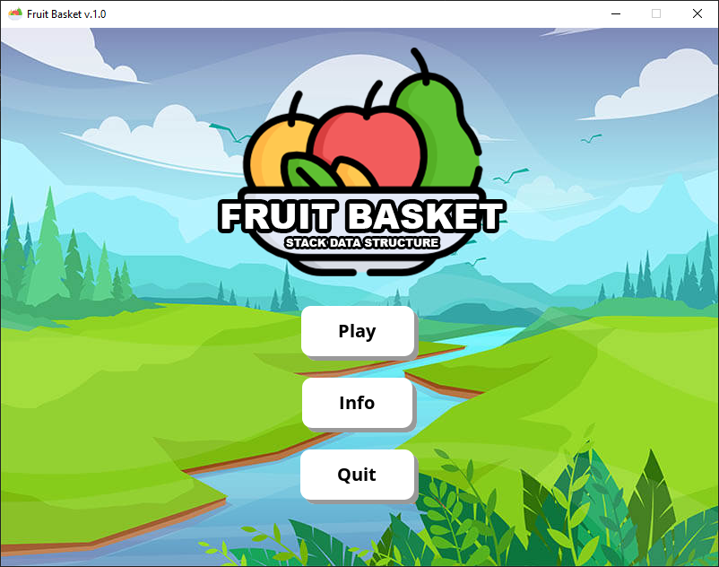
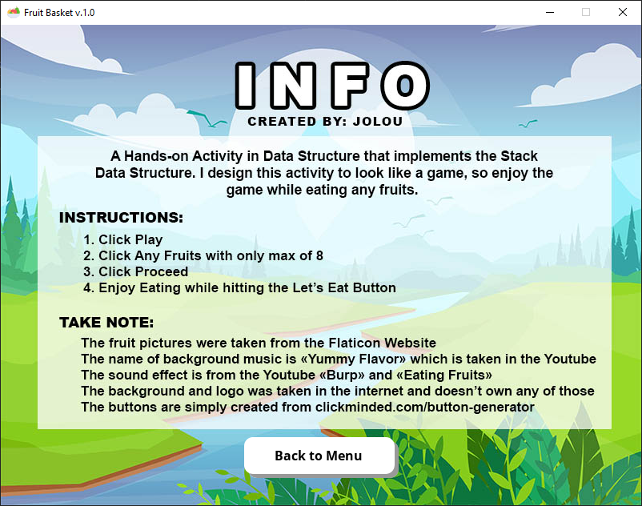
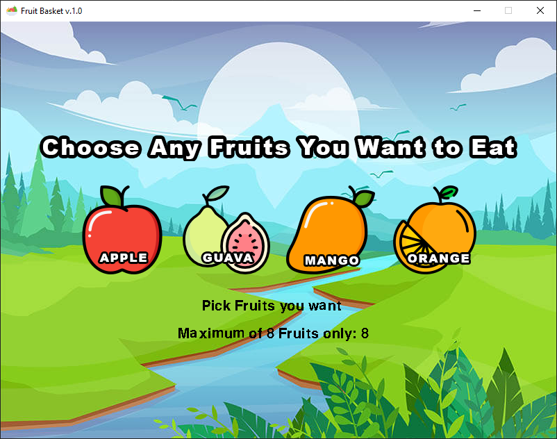
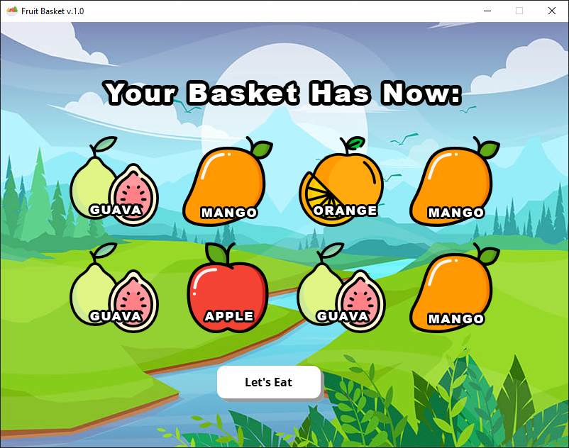
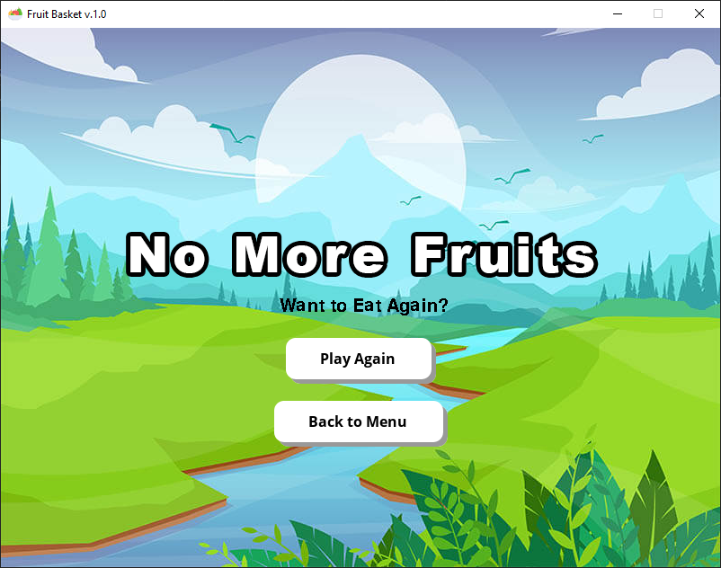

<h3 align="center">
    
</h3>

	<b> A Hands-on Activity in Data Structure that Implements the Stack Data Structure. I design this activity to look like a game, so enjoy the game while eating any fruits </b>

## Run the Main Script
Download python3 in device then install pygame in pip terminal to run the main script

` pip install pygame `

## Game Screenshot:

	
	
	
	
	

## Instructions: 
1. Click Play Button
2. Click any fruits you wanted with only a max of 8
3. Click Proceed
4. Enjoy Eating while hitting the Let's Eat Button
5. You can either click Play Again or Back to Menu once finished eating

## Game Resources:
- Background Image - Designed using resources from [Freepik.com](https://www.freepik.com/)
-  Fruit Graphics - Designed using resources from [Flaticon.com](https://www.flaticon.com/) 
-  Background Music - [Yummy Flavor](https://www.youtube.com/watch?v=gDIccWzH4NY&t=163s) (0:00s to 1:03s) 
-  Sound Effects:
	- [Burp Effect](https://www.youtube.com/watch?v=MlhZVIvFlgk)
	- [Eating Fruits Effect](https://www.youtube.com/watch?v=2LJqc4WHisg)

## Contribution:
If you wish to help improve this project, fork this repo and submit your own pull request. If you discover a problem with this project, please report it to the issue page. Thank you very much   😊.

## Thank you 
If you like this project just click ⭐ and share it with others.
